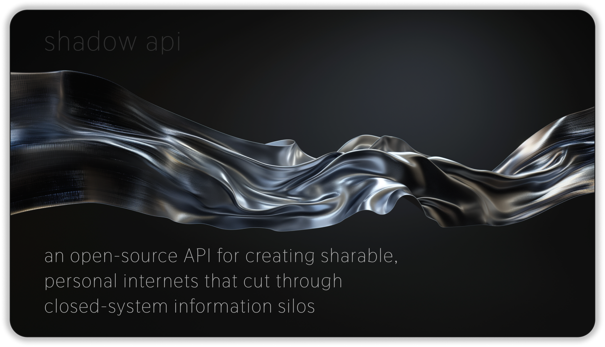
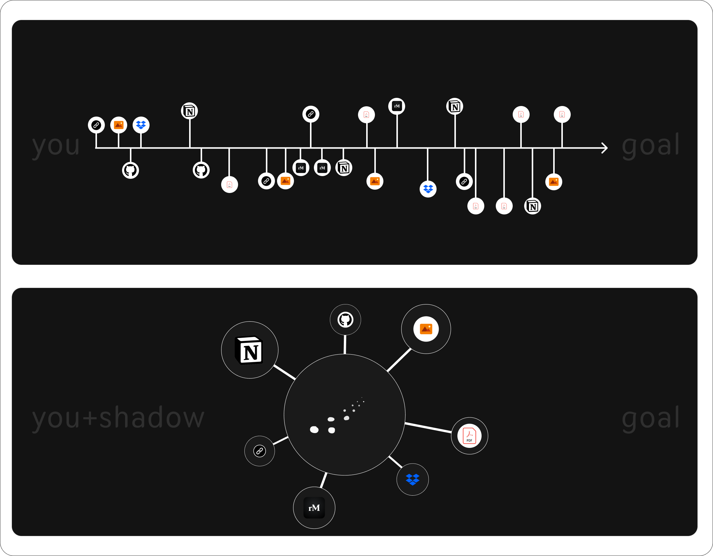
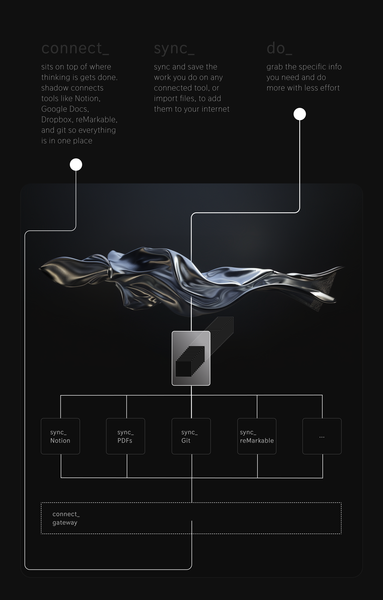

# Shadow
Shadow is an open-source API for developing personal internets that can be shared, licensed, and navigated with an AI assistant. With Shadow, you can turn scattered information trails into meaningful knowledge networks that tell the story of your current project and help you accomplish more.

## Introduction
In the course of working towards a goal, we often generate and explore a lot of information - notes, web pages, documents, code snippets, images, and more. This information trail is valuable, but is usually scattered across many different apps and services. Shadow provides a way to aggregate everything you read, write, explore and create related to a goal into a unified space - your \"personal internet\".

By integrating with the tools and services you already use, like Notion, Dropbox, reMarkable, and more, Shadow orchestrates the internet behind the scenes while you focus on finding, collecting, and understanding the information you need to accomplish your goal. All information loaded into Shadow is navigated with the AI assistant that helps you search and use the knowledge to accomplish your goal. Shadow intentionally offers minimal navigation beyond the assistant to avoid the distraction of information tending and uses a tag-based system to organize your internets. You can also share your internets with others or list them on the Shadow marketplace.

## Getting Started

1. Clone the Shadow repo and navigate into the directory
2. Install the required Python packages: `pip install -r requirements.txt` 
3. Install the front-end dependencies: `npm install`
4. Start the back-end server: `python app.py`
5. In a separate terminal, start the front-end: `npm start`
6. Navigate to `http://localhost:3000` to use Shadow

## Prerequisites
To run Shadow, you'll need:
- Python 3.9 or higher
- The following Python packages: flask, chromaDB, notion_client, dropbox, openai, anthropic, fitz

## Front-end
The Shadow front-end is built with:
- npm 
- React
- react-feather
- axios
- SimpleMDE

To install the front-end dependencies, run `npm install`. To start the front-end dev server, run `npm start`.

## Back-end
The Shadow back-end is a Python Flask application. It uses ChromaDB as the vector database for storing and searching embeddings.

## API Reference
Shadow exposes the following key API endpoints:
- `POST /shadow/plugins/{plugin_name}` - Configure a new integration plugin
- `GET /shadow/internets` - List your internets based on the tags you have creates
- `POST /shadow/internets` - Create a new tag
- `GET /shadow/internets/{internet_id}` - Get a specific internet
- `POST /shadow/assistant` - Query the AI assistant. Takes in a query string and an optional search scope
- `POST /shadow/files` - Upload a file for the assistant. Supports .pdf and all image files.
- `POST /shadow/urls` - Have the assistant scrape text from a web page

Full API documentation will bee posted soon, please keep an eye on [Shadow API Docs](https://shadownotes.ai/docs).

## Contributing
We welcome contributions to Shadow! Some key areas where we'd love community involvement:
- Building new integration plugins for popular tools and services: Bump Perplexity, Github, Slack
- Expanding the capabilities of the AI assistant
- Improving PDF parsing and annotation extraction
- Build an app

